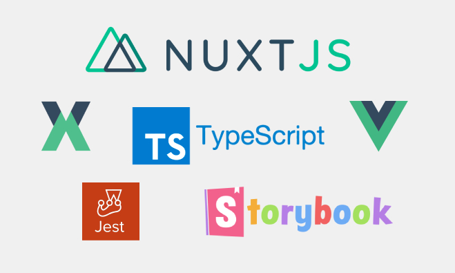

<p align="center">  
  
</p>

# Landing Page Template - Nuxt, Typescript, Vue3 Composition API, Vuex, Storybook, Jest and Vue Test Utils

### The Project is built and packaged with Yarn

https://classic.yarnpkg.com/en/docs/

## Yarn Commands

```bash
# install dependencies
$ yarn install

# serve with hot reload at localhost:3000
$ yarn dev

# build for production and launch server
$ yarn build
$ yarn start

# generate static project
$ yarn generate
```

## Nuxt
The Universal SSR application is built with Nuxt 2.15 which has Typescript support built in - https://typescript.nuxtjs.org/guide/introduction).

For detailed explanation on how things work, check out [Nuxt.js docs](https://nuxtjs.org).

## Composition API
Nuxt 2 does not yet have built in support for vue 3 or the composition API, but the application takes advantage of the new features offered by Vue 3, by importing the nuxtjs composition-api package and using a slightly differennt syntax for some declarations.

https://yarnpkg.com/package/@nuxtjs/composition-api

## Storybook JS Styleguide
Storybook Js is a UII component explorer for front end developers. It runs alongside the application, with stories defined for UI components.

https://storybook.js.org/docs/vue/get-started/introduction

and more specifically the project uses nuxt-storybook.

https://storybook.nuxtjs.org/

Run the following command to launch the storybook server and view the applications components design, variations and actions in isolation:

```
yarn nuxt storybook
```
## Testing - Vue test utils and Jest

Tests use the Jest and vue-test-utils frameworks. 

https://github.com/vuejs/vue-jest

https://vue-test-utils.vuejs.org/

Test files are located in the corresponding components directory.

```
yarn test
```

#### *Currently tests are not written in Typescript. Typescript will be incorporated into the test suite using the t-jest package in the subsequent release.


