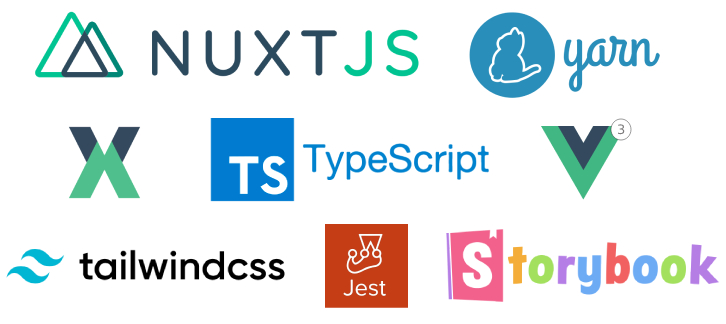
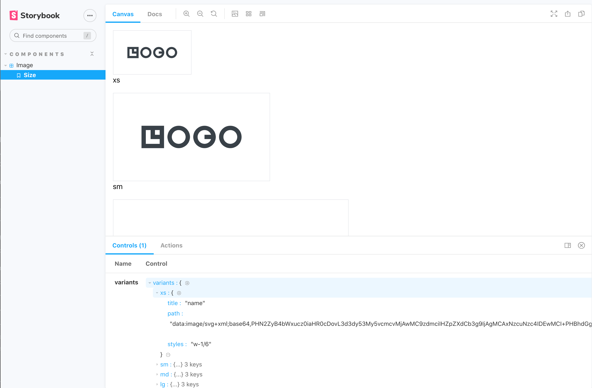

<p align="center">  
  
</p>

# Landing Page template - Yarn, Nuxt, Typescript, Vue3 Composition API, Vuex, Tailwind, Storybook, Jest and Vue Test Utils.
<br/><br/>


### The Project is built and packaged with Yarn

https://classic.yarnpkg.com/en/docs/

## Yarn Commands

```bash
# install dependencies
$ yarn install

# serve with hot reload at localhost:3000
$ yarn dev

# build for production and launch server
$ yarn build
$ yarn start

# generate static project
$ yarn generate
```
<br/>
<br/>


## Nuxt
The Universal SSR application is built with Nuxt 2.15 which has Typescript support built in - https://typescript.nuxtjs.org/guide/introduction).

To configure Nuxt edit the /nuxt.config.js file.

For detailed explanation on how things work, check out [Nuxt.js docs](https://nuxtjs.org).
<br/><br/><br/>


## Composition API
Nuxt 2 does not yet have built in support for vue 3 or the composition API, but the application takes advantage of the new features offered by Vue 3, by importing the nuxtjs composition-api package and using a slightly differennt syntax for some declarations.

Things to note when using the Composition API with nuxt:

- In order to access the store you must 

https://yarnpkg.com/package/@nuxtjs/composition-api
<br/><br/><br/>


## Typescript
Although Typescript is supported through the nuxt-typescript package further configuration was needed for different issues.

- In order to be able to use @ or ~ in paths in Typescript files:

```
yarn add --dev tsconfig-paths
```

- Adding a vue-shims.d.ts file to the root directory so that the Vue is typed:

```
/** vue-shims.d.ts */
declare module "*.vue" {
  import Vue from 'vue'
  export default Vue
}
```

- Adding a testRegex statement to **package.json** so that Typescript can recognise Jest test files with **.ts** extensions. (***note the "__test__" part**). 

```
"jest": {
    /** ... */
    "testRegex": "(/__test__/.*|(\\.|/)(test|spec))\\.(jsx?|tsx?)$"
}
```

- and add the following types to your ts.config.js.

```
compilerOptions:{
  /** ... */
 "types": [
      "@nuxt/types",
      "@types/node",
      "@types/jest"
    ]
}
```

- In order for Vuex to be typed correctly the project uses the **nuxt-typed-vuex** pacakage which provides typing for vuex store, getters, setter, actions etc.

Common Interfaces and types can be found in the **/typescript/interfaces.ts** file.

When runnig yarn dev or build Typescript will check for type errors.

for more info check:
https://typed-vuex.roe.dev/getting-started-nuxt

<br/><br/>

The applications state is managed with Nuxt's integrated VueX package and the **nuxt-typed-vuex package, which offers a strongly typed accessor for reading and communicating with the Vuex store.

Nuxt Typed Vuex Store $accessor:

```
/** Create reference to typed vuex accessor */
const useAccessor = wrapProperty("$accessor", false);
const typedStore = useAccessor();
const yourVar = typedStore.module.yourProperty;
```
or another approach:

```
const { $accessor } = useContext()
const yourVar = $accessor.module.yourProperty;
```

and to access a variable in the store and use it in your component for example:

```
let yourString: ComputedRef<string> = computed(
    (): string => typedStore.youModule.yourString
);
```

<br/><br/>


## Storybook JS Styleguide
Storybook Js is a UI component explorer for front end developers. It runs alongside the application, with stories defined for UI components.

https://storybook.js.org/docs/vue/get-started/introduction

and more specifically the project uses nuxt-storybook.

https://storybook.nuxtjs.org/

Tests are written in Typescript.

Run the following command to launch the storybook server and view the applications components design, variations and actions in isolation:

```
yarn nuxt storybook
```
<br/>


Shared Typescript interfaces for Stroybook can be found in the **/typescript/interfaces-storybook.ts** file.

<br/><br/>


## Testing - Vue test utils and Jest

Tests use the Jest and vue-test-utils frameworks. 

https://github.com/vuejs/vue-jest

https://vue-test-utils.vuejs.org/

Test files are located in the corresponding components directory with a "/__test__" directory. 

Tests are written in Typescript. Common functions used for consntructing stories can be found within **/helpers/storybook.ts**

```
yarn test
```
To configure Jest edit the /jest.config.js file.

On configuration of importance was the need to add the following for the nuxtjs/compoition-api to be made available to jest tests:
```
moduleNameMapper: {
  // ...
  '@nuxtjs/composition-api': '@nuxtjs/composition-api/lib/entrypoint.js'
}

<br/><br/>


## Styling Components

Components in the applicationn are styled using the TailwindCSS, a utility-first CSS framework which uses Utility classes to help you work within the constraints of the configured design system instead of littering your stylesheets with arbitrary values.

The application uses the @nuxtjs/tailwindcss package to integrate Tailwind with Nuxt:

For more info check:

https://tailwindcss.nuxtjs.org/

https://tailwindcss.com/docs

What other packages of interest are included in the application:

babel-plugin-wildcard
To enable imports with * in a directory.
https://github.com/vihanb/babel-plugin-wildcard


